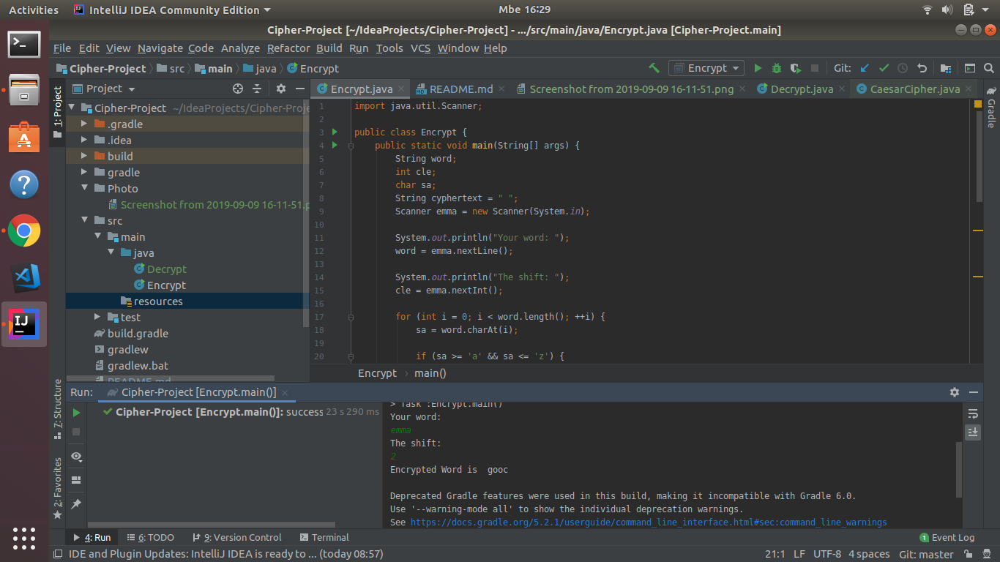
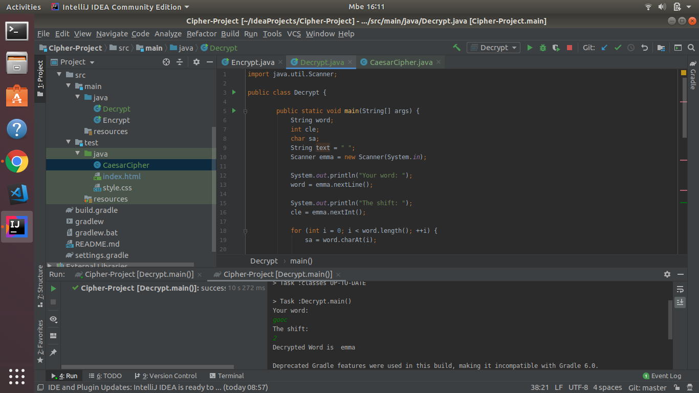

##  Caesar-Cipher

##  Author 

Emma NYIRATE

##  Description

 You enter the word that you want to encrypt and then get its encrypted version
 
 ##  Requirements
 
 IntelliJ and Github
 
 ##  BDD
 
 You need an input form where you enter your word or message,and an encrypt button where you will click in order to get your encrypted version
 
 ##  GitHub Link
  https://github.com/Nyirate/Cipher-Project
  
 ## Known Bugs
 
 No Bugs
 
 ##  Technologies Used
 
 Java,HTML and CSS
 
 ## Photos of Codes 
 
 
 
 ## License
 
Approved by MIT and Moringa School
